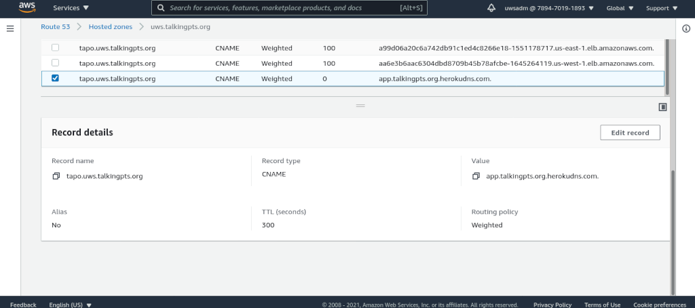

# Server down incident response plan

Contingency plan.

## Deploy

Deploy web containers to heroku [tapo webapp](https://dashboard.heroku.com/apps/tapo).

## Route traffic

Login to [AWS console](https://console.aws.amazon.com/) with *uwsadm* IAM user
credentials. (Check secret/aws.txt).

Update [AWS DNS](https://console.aws.amazon.com/route53/v2/hostedzones#ListRecordSets/Z007316630R8ZSSQX09RD)
settings to route traffic to heroku.

Edit heroku weighted record to start routing traffic to them. As shown in the
following image:

Edit the **Weighted** records as needed.

If all the records have the **same** weight, the DNS will work as a **round robin** setup,
so if the 3 records (east, west and heroku) have the same value (ie: 100), 1/3 of the
traffic will go to each of them.

Any record set with a **0 (zero)** weight will **not** be used.

So if you need to send **all** the traffic to heroku, set the **heroku** record to **100**
and set **east** and **west** records to **0 (zero)**.

You can play with the weight values as needed, in example: set heroku to 100,
east to 50 and west to 50, so most of the traffic will be sent to heroku but aws
clusters will still get some traffic. And so...
