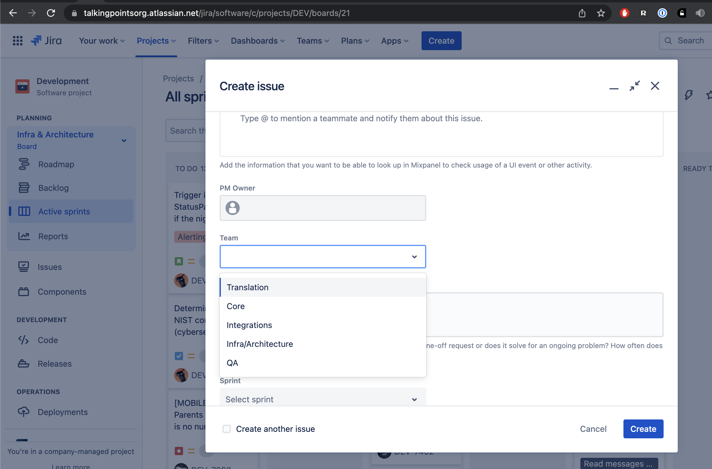

# Jira for Infrastructure team

Board: [DEV/boards/21](https://talkingpointsorg.atlassian.net/jira/software/c/projects/DEV/boards/21)

Create an issue as follows:

* __Project__: Development (DEV)
* __Issue type__: Story
* __Summary__: Of course
* __Description__: It sounds obvious, but it's not
* __Team__: Infra/Architecture
* __Sprint__: Infra Backlog
